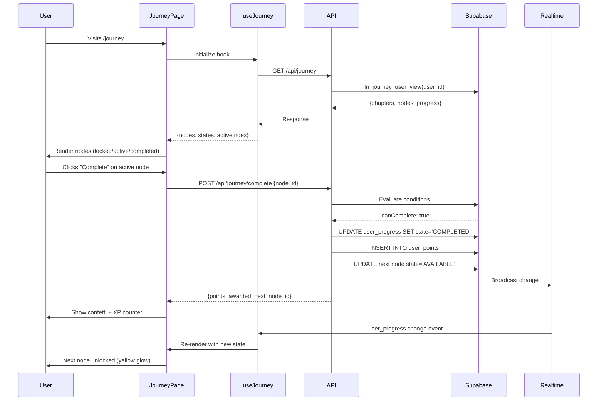

# Journey Page — System Overview & Editing Guide

**Version:** 1.0
**Last Updated:** 2025-01-28
**Target Audience:** Developers editing the Journey/Map gamification system

---

## Table of Contents

1. [High-Level Architecture](#1-high-level-architecture)
2. [Data Model & Database Tables](#2-data-model--database-tables)
3. [API Endpoints Reference](#3-api-endpoints-reference)
4. [Progression Model](#4-progression-model)
5. [UI Components & File Map](#5-ui-components--file-map)
6. [Realtime & State Updates](#6-realtime--state-updates)
7. [Editing Recipes](#7-editing-recipes)
8. [Sanity Checklist](#8-sanity-checklist)

---

## 1. High-Level Architecture

The Journey system is a **gamified progression map** where users complete tasks (nodes) to earn points and unlock new challenges. It follows a linear chapter-based structure with gated progression.

### Architecture Diagram

```
┌──────────────┐
│   User (App) │
└──────┬───────┘
       │
       ├─────────→ GET /api/journey
       │           (fetch chapters + nodes + progress)
       │
       ├─────────→ POST /api/journey/complete
       │           (mark node complete, award points)
       │
       ├─────────→ POST /api/journey/track
       │           (update progress in real-time)
       │
       ↓
┌────────────────────────────────────────────┐
│         Supabase Backend                   │
│  ┌──────────────────────────────────────┐  │
│  │ Tables:                              │  │
│  │  - journey_chapters                  │  │
│  │  - journey_nodes                     │  │
│  │  - user_progress                     │  │
│  │  - user_points                       │  │
│  │  - user_badges                       │  │
│  └──────────────────────────────────────┘  │
│                                            │
│  ┌──────────────────────────────────────┐  │
│  │ SQL Functions:                       │  │
│  │  - fn_journey_user_view()            │  │
│  │  - fn_user_context()                 │  │
│  └──────────────────────────────────────┘  │
│                                            │
│  ┌──────────────────────────────────────┐  │
│  │ Realtime:                            │  │
│  │  - user_progress channel             │  │
│  │  - Broadcasts state changes          │  │
│  └──────────────────────────────────────┘  │
└────────────────────────────────────────────┘
       │
       │ (Realtime WebSocket)
       │
       ↓
┌──────────────────────────────┐
│  Client-Side State           │
│  - useJourney() hook         │
│  - useJourneyHeader() hook   │
│  - UI updates automatically  │
└──────────────────────────────┘
```

### Key Principles

1. **Linear Progression**: Users must complete nodes in order within each chapter
2. **Gated Unlocking**: Next node only unlocks after completing current node
3. **Real-time Updates**: Progress updates without page refresh via Supabase Realtime
4. **Points & Badges**: Gamification rewards for completing milestones
5. **Condition-Based**: Nodes evaluate user data (meals logged, weigh-ins, streaks) before allowing completion

---

## 2. Data Model & Database Tables

### Schema Overview

| Table | Purpose | Key Columns | Relations |
|-------|---------|-------------|-----------|
| `journey_chapters` | Main sections of journey (e.g., "Basics", "Advanced") | `id`, `title`, `order_index` | 1:N → `journey_nodes` |
| `journey_nodes` | Individual tasks/milestones | `id`, `chapter_id`, `title`, `order_index`, `conditions_json` | N:1 → `journey_chapters` |
| `user_progress` | Tracks user state for each node | `user_id`, `node_id`, `state`, `progress_json`, `completed_at` | Composite PK: (user_id, node_id) |
| `user_points` | Points log | `id`, `user_id`, `points`, `reason`, `date` | N:1 → `users` |
| `user_badges` | Achievement badges | `id`, `user_id`, `badge_code`, `earned_at` | UNIQUE (user_id, badge_code) |

### Table Details

#### `journey_chapters`

```sql
CREATE TABLE journey_chapters (
  id uuid PRIMARY KEY DEFAULT gen_random_uuid(),
  title text NOT NULL,              -- e.g., "שלב הבסיסים"
  order_index int NOT NULL,         -- Determines visual order
  created_at timestamptz DEFAULT now()
);
```

**Example Rows:**
```
| id | title | order_index |
|----|-------|-------------|
| ... | שלב הבסיסים | 0 |
| ... | שלב הפרי | 1 |
```

#### `journey_nodes`

```sql
CREATE TABLE journey_nodes (
  id uuid PRIMARY KEY DEFAULT gen_random_uuid(),
  chapter_id uuid NOT NULL REFERENCES journey_chapters(id),
  title text NOT NULL,              -- e.g., "שקילה ראשונה"
  description text,                 -- Subtitle/help text
  order_index int NOT NULL,         -- Order within chapter
  icon text,                        -- Icon name (e.g., "Scale")
  primary_task text,                -- Main action description
  conditions_json jsonb NOT NULL,   -- Unlock/complete conditions
  created_at timestamptz DEFAULT now()
);
```

**Example `conditions_json`:**
```json
{
  "primary": "weigh_in_today",
  "checklist": [],
  "thresholds": {}
}
```

```json
{
  "primary": "log_3_meals",
  "checklist": ["log_2_meals", "log_3_meals"],
  "thresholds": {}
}
```

```json
{
  "primary": "protein_min",
  "checklist": ["log_3_meals", "protein_min"],
  "thresholds": {
    "protein_g": 100
  }
}
```

#### `user_progress`

```sql
CREATE TABLE user_progress (
  user_id uuid NOT NULL,
  node_id uuid NOT NULL REFERENCES journey_nodes(id),
  state text NOT NULL CHECK (state IN ('LOCKED', 'AVAILABLE', 'ACTIVE', 'COMPLETED')),
  progress_json jsonb DEFAULT '{}',  -- Custom progress data
  completed_at timestamptz,
  updated_at timestamptz DEFAULT now(),
  PRIMARY KEY (user_id, node_id)
);
```

**State Values:**
- `LOCKED`: User hasn't unlocked this node yet (previous node not completed)
- `AVAILABLE`: Node is unlocked but not started
- `ACTIVE`: User is working on this node (not needed in current impl)
- `COMPLETED`: Node is finished, points awarded

#### `user_points`

```sql
CREATE TABLE user_points (
  id uuid PRIMARY KEY DEFAULT gen_random_uuid(),
  user_id uuid NOT NULL,
  date date DEFAULT current_date,
  points int NOT NULL,              -- Points awarded (typically 10-50)
  reason text,                      -- e.g., "השלמת: שקילה ראשונה"
  created_at timestamptz DEFAULT now()
);
```

#### `user_badges`

```sql
CREATE TABLE user_badges (
  id uuid PRIMARY KEY DEFAULT gen_random_uuid(),
  user_id uuid NOT NULL,
  badge_code text NOT NULL,         -- e.g., "first_node", "streak_7"
  earned_at timestamptz DEFAULT now(),
  UNIQUE (user_id, badge_code)
);
```

### RLS Policies

All user tables have Row-Level Security enabled:
- Users can only see/modify their own data: `WHERE user_id = auth.uid()`
- `journey_chapters` and `journey_nodes` are read-only (no RLS) - managed by SQL migrations

---

## 3. API Endpoints Reference

### GET `/api/journey`

**Purpose:** Fetch all chapters, nodes, and user's progress
**Auth:** Required (returns empty if not logged in)
**Method:** GET

**Response:**
```typescript
{
  ok: true,
  auth: true,
  data: {
    chapters: [
      {
        id: string,
        title: string,
        order_index: number,
        nodes: [
          {
            id: string,
            title: string,
            description: string,
            order_index: number,
            icon: string,
            primary_task: string,
            conditions_json: object,
            user_progress: {
              state: 'LOCKED' | 'AVAILABLE' | 'COMPLETED',
              progress_json: object,
              completed_at: string | null
            }
          }
        ]
      }
    ],
    total_points: number,
    total_badges: number
  }
}
```

**Files:**
- Handler: `apps/web/app/api/journey/route.ts`
- SQL Function: `fn_journey_user_view(p_user uuid)`

**Usage:**
```typescript
const res = await fetch('/api/journey');
const { data } = await res.json();
```

---

### POST `/api/journey/complete`

**Purpose:** Mark a node as completed, award points, unlock next node
**Auth:** Required
**Method:** POST

**Request Body:**
```typescript
{
  node_id: string (uuid)
}
```

**Response:**
```typescript
{
  ok: true,
  points_awarded: number,
  next_node_id: string | null,
  message: string
}
```

**Error Responses:**
```typescript
// Conditions not met
{
  ok: false,
  error: "ConditionsNotMet",
  message: "Node conditions not satisfied",
  missing: ["log_3_meals", "protein_min"],
  satisfied: ["weigh_in_today"]
}

// Not authenticated
{
  ok: false,
  error: "Unauthorized",
  message: "Authentication required"
}
```

**Files:**
- Handler: `apps/web/app/api/journey/complete/route.ts`
- Compute Logic: `apps/web/lib/journey/compute.ts`

**Usage:**
```typescript
const res = await fetch('/api/journey/complete', {
  method: 'POST',
  headers: { 'Content-Type': 'application/json' },
  body: JSON.stringify({ node_id: 'abc-123' })
});
```

---

### POST `/api/journey/track`

**Purpose:** Update progress for a node in real-time (e.g., increment counter)
**Auth:** Required
**Method:** POST

**Request Body:**
```typescript
{
  node_id: string,
  progress_json: object  // Custom progress data
}
```

**Files:**
- Handler: `apps/web/app/api/journey/track/route.ts`

---

## 4. Progression Model

### Chapter Structure

**Current Chapters:**
1. **שלב הבסיסים (BASICS)** - Foundational habits (weigh-in, log meals, hit protein)
2. **שלב הפרי (ADVANCED)** - Streaks and consistency (3-day streak, 7-day streak)

### Node Types & Conditions

| Node Type | TypeScript Enum | Unlock Condition | Complete Condition | Points | Side Effects |
|-----------|-----------------|------------------|-------------------|--------|--------------|
| First Weigh-in | `FIRST_WEIGH_IN` | First node | User has 1+ weigh-in record | 10 | Unlocks next node |
| Log Meals Today | `LOG_MEALS_TODAY` | Previous completed | User logged 3+ meals today | 20 | Unlocks next node |
| Hit Protein Goal | `HIT_PROTEIN_GOAL` | Previous completed | Protein today ≥ target (default 100g) | 30 | Unlocks next node |
| 3-Day Streak | `WEEK_STREAK_3` | Previous completed | User logged meals 3 consecutive days | 40 | Unlocks next node, may award badge |
| 7-Day Streak | `WEEK_STREAK_7` | Previous completed | User logged meals 7 consecutive days | 50 | Unlocks next node, may award badge |

### State Machine

```
     ┌─────────┐
     │ LOCKED  │ (Gray, opacity-40, Lock icon)
     └────┬────┘
          │
          │ (Previous node completed)
          ↓
     ┌──────────┐
     │ AVAILABLE│ (Not used in current UI, goes directly to progress check)
     └────┬─────┘
          │
          │ (Conditions checked in real-time)
          ↓
     ┌────────────────┐
     │ ACTIVE         │ (Yellow glow, progress %, CTA button)
     │ (progress < 1) │
     └────┬───────────┘
          │
          │ (User clicks "Complete" button when progress = 100%)
          ↓
     ┌───────────┐
     │ COMPLETED │ (Green checkmark, no CTA)
     └───────────┘
```

**State Transitions:**

1. **LOCKED → ACTIVE**: When previous node in chapter is completed
2. **ACTIVE → COMPLETED**: When user manually confirms completion (progress must be 100%)
3. **No ACTIVE state in DB**: Current implementation checks progress in real-time and shows state purely in UI

### Points & Streak Rules

#### Points Award

- Points are awarded **only on completion** (POST `/api/journey/complete`)
- Default points: 25 (overridden by node definition)
- Points are logged in `user_points` table with reason
- Total points displayed in header

#### Streak Calculation

**Meal Logging Streak:**
```typescript
// From lib/journey/rules.ts
function calculateStreak(meals: Array<{ created_at: string }>): number {
  // 1. Group meals by date
  // 2. Sort dates descending
  // 3. Check if today has a meal (if not, streak = 0)
  // 4. Count consecutive days backward from today
  return streak;
}
```

**Rules:**
- Streak resets to 0 if no meal logged today
- Only counts consecutive days
- One meal per day is sufficient to maintain streak

---

## 5. UI Components & File Map

### Component Tree

```
app/(app)/journey/page.tsx
├── journey.css (safe-area, sticky header, chip styles)
├── components/journey/Header.tsx
│   ├── PointsChip (Trophy icon + total points)
│   ├── StreakChip (Flame icon + consecutive days)
│   ├── ChapterPill (MapPinned icon + chapter name)
│   └── ProgressBar (gradient bar, 0-100%)
├── components/journey/KpiStrip.tsx
│   └── 4 KPI cards (Calories, Protein, Weight, Streak)
├── components/journey/EnergyPath.tsx
│   └── Animated connecting lines between nodes
├── Node Rendering Loop
│   ├── components/ui/Icon.tsx (Lucide icon wrapper)
│   ├── CheckCircle2 (completed state)
│   ├── Lock (locked state)
│   ├── Scale / UtensilsCrossed / TrendingUp / CalendarDays (active state icons)
│   └── Progress % display
├── components/journey/Confetti.tsx (celebration animation)
└── components/journey/XPCounter.tsx (floating +Points animation)
```

### Component Reference

#### `Header.tsx`

**Location:** `apps/web/components/journey/Header.tsx`

**Props:**
```typescript
{
  points: number;          // Total points earned
  streak: number;          // Consecutive days with activity
  chapterName: string;     // Current chapter (Hebrew)
  progress: number;        // 0-100 (% of nodes completed)
}
```

**Purpose:** Premium header with title, chips, chapter pill, and progress bar

**Editing:**
- **Change title/subtitle:** Line 21-26 (Hebrew strings)
- **Chip layout:** Line 31-35 (flex column, items-end)
- **Colors:** Line 53 (`#E2F163`), Line 62 (`text-amber-400`), Line 73 (`text-emerald-400`)

---

#### `ProgressBar.tsx`

**Location:** `apps/web/components/journey/ProgressBar.tsx`

**Props:**
```typescript
{
  value: number;  // 0-100
  label?: string; // Optional label above bar
}
```

**Purpose:** Animated gradient progress bar

**Editing:**
- **Gradient colors:** Line 18-19 (`#E2F163` to `#c7ff4a`)
- **Bar height:** Line 15 (`h-2`)
- **Animation speed:** Line 16 (`duration-500`)

---

#### `KpiStrip.tsx`

**Location:** `apps/web/components/journey/KpiStrip.tsx`

**Purpose:** 4 metric cards below header (Calories, Protein, Weight, Streak)

**Editing:**
- **Add new KPI:** Add entry to `kpiCards` array (Line 46)
- **Change colors:** Edit `gradient`, `textColor`, `shadowColor` per card
- **Card layout:** Line 98 (`grid-cols-4`)
- **Icons:** Import from `lucide-react`, set in `icon` field

---

#### `page.tsx` (Journey Page)

**Location:** `apps/web/app/(app)/journey/page.tsx`

**Key Functions:**
- `getNodeIcon(nodeType, status)`: Maps node type → Lucide icon
- `handleNodeClick(nodeId, idx)`: Calls complete API, shows confetti, reloads

**Editing:**
- **Icon mapping:** Line 37-48
- **Node styling (active/completed/locked):** Line 222-236
- **Progress display:** Line 249-260
- **Points display:** Line 264-270

---

#### `useJourney.ts`

**Location:** `apps/web/lib/journey/useJourney.ts`

**Hooks:**
1. `useJourney()`: Fetches nodes, states, activeIndex
2. `useJourneyHeader()`: Extracts points, streak, chapterName, progress

**Editing:**
- **Demo data:** Line 7-44 (fallback nodes if API fails)
- **Chapter name mapping:** Line 188-192 (BASICS → "שלב הבסיסים")
- **Streak placeholder:** Line 199 (currently hardcoded to 0, TODO: wire to backend)

---

#### `rules.ts`

**Location:** `apps/web/lib/journey/rules.ts`

**Purpose:** Evaluates node progress conditions

**Functions:**
- `evalNodeProgress(node, ctx)`: Checks user data against node type
- `calculateStreak(meals)`: Calculates consecutive days

**Editing:**
- **Add new node type:** Add case to switch statement (Line 20)
- **Change meal goal:** Line 38 (`const goal = 3`)
- **Change protein target:** Line 49 (`ctx.proteinTarget ?? 100`)
- **Streak calculation:** Line 79-110 (consecutive days logic)

---

## 6. Realtime & State Updates

### Sequence Diagram



### Realtime Subscription

**File:** `apps/web/lib/journey/realtime.ts`

**Setup:**
```typescript
supabase
  .channel('user_progress')
  .on(
    'postgres_changes',
    {
      event: '*',
      schema: 'public',
      table: 'user_progress',
      filter: `user_id=eq.${userId}`
    },
    (payload) => {
      console.log('Progress updated:', payload);
      // Trigger re-fetch or update local state
    }
  )
  .subscribe();
```

**Current Implementation:**
The app uses `window.location.reload()` after completion (Line 71 in `page.tsx`) instead of real-time updates. This ensures clean state refresh but could be optimized to use realtime events.

---

## 7. Editing Recipes

### 7.1 Add a New Node Type

**Steps:**

1. **Add TypeScript enum** (`apps/web/lib/journey/types.ts`):
```typescript
export type NodeType =
  | 'FIRST_WEIGH_IN'
  | 'LOG_MEALS_TODAY'
  | 'HIT_PROTEIN_GOAL'
  | 'WEEK_STREAK_3'
  | 'WEEK_STREAK_7'
  | 'CUSTOM_NEW_TYPE';  // ← Add this
```

2. **Add evaluation logic** (`apps/web/lib/journey/rules.ts`):
```typescript
case 'CUSTOM_NEW_TYPE': {
  // Your custom logic
  const { data } = await supabase
    .from('your_table')
    .select('*')
    .eq('user_id', ctx.userId);

  const progress = /* calculate 0-1 */;
  return state(node, progress);
}
```

3. **Add icon mapping** (`apps/web/app/(app)/journey/page.tsx:37`):
```typescript
function getNodeIcon(nodeType: string, status: string) {
  if (status === "COMPLETED") return CheckCircle2;
  if (status === "LOCKED") return Lock;

  if (nodeType.includes("CUSTOM_NEW")) return YourIcon; // ← Add this
  // ... rest
}
```

4. **Create database row** (Supabase SQL Editor):
```sql
INSERT INTO journey_nodes (
  chapter_id,
  title,
  description,
  order_index,
  icon,
  primary_task,
  conditions_json
) VALUES (
  (SELECT id FROM journey_chapters WHERE title = 'שלב הבסיסים'),
  'כותרת חדשה',
  'תיאור',
  4,  -- order after existing nodes
  'YourIcon',
  'פעולה ראשית',
  '{"primary": "your_condition_key", "checklist": [], "thresholds": {}}'::jsonb
);
```

5. **Add condition evaluator** (`apps/web/lib/journey/compute.ts:50`):
```typescript
case "your_condition_key":
  return (userContext.your_metric || 0) >= (thresholds.your_threshold || 10);
```

---

### 7.2 Change Points or Streak Logic

#### Change Points Per Node

**Database:**
```sql
-- Set points for specific node
UPDATE journey_nodes
SET conditions_json = jsonb_set(
  conditions_json,
  '{points}',
  '50'  -- New points value
)
WHERE title = 'שקילה ראשונה';
```

**Code (default):**
`apps/web/app/api/journey/complete/route.ts:150`
```typescript
const pointsAwarded = 25;  // ← Change default here
```

#### Change Streak Calculation

`apps/web/lib/journey/rules.ts:79-110`

**Current logic:**
- Requires meal logged today to maintain streak
- Counts consecutive days backward from today

**To change:**
- Modify `calculateStreak()` function
- Example: Allow 1-day gap: Check if gap between dates is ≤ 1

---

### 7.3 Add or Reorder Nodes/Chapters

#### Add a Chapter

```sql
INSERT INTO journey_chapters (title, order_index)
VALUES ('שלב המומחים', 2);  -- order_index determines position
```

#### Reorder Nodes

```sql
-- Swap order of two nodes
UPDATE journey_nodes
SET order_index = CASE id
  WHEN 'node-id-1' THEN 1
  WHEN 'node-id-2' THEN 0
  ELSE order_index
END
WHERE id IN ('node-id-1', 'node-id-2');
```

#### Add a Node (Full Example)

```sql
WITH target_chapter AS (
  SELECT id FROM journey_chapters WHERE title = 'שלב הבסיסים'
)
INSERT INTO journey_nodes (
  chapter_id,
  title,
  description,
  order_index,
  icon,
  primary_task,
  conditions_json
)
SELECT
  id,
  'משימה חדשה',
  'תיאור המשימה',
  (SELECT COALESCE(MAX(order_index), 0) + 1 FROM journey_nodes WHERE chapter_id = target_chapter.id),
  'Zap',
  'בצע פעולה X',
  '{"primary": "log_3_meals", "checklist": [], "thresholds": {}}'::jsonb
FROM target_chapter;
```

---

### 7.4 Update Copy, Colors, Icons

#### Hebrew Strings

**Header title/subtitle:**
`apps/web/components/journey/Header.tsx:21-26`
```typescript
<h1>מסע הכושר שלי</h1>
<p>עקוב אחרי ההתקדמות שלך בדרך ליעד</p>
```

**Node titles (database):**
```sql
UPDATE journey_nodes
SET title = 'כותרת חדשה בעברית',
    description = 'תיאור מפורט'
WHERE id = 'node-id-here';
```

**Chip labels:**
`apps/web/components/journey/Header.tsx:53, 62, 73`

---

#### Colors

**Brand accent (yellow):**
Global: `#E2F163`

**Where to change:**
- Header chips: `components/journey/Header.tsx:53` (Trophy icon)
- Progress bar: `components/journey/ProgressBar.tsx:18`
- Active node glow: `app/(app)/journey/page.tsx:226`

**Completed (green):**
Global: `text-emerald-400`, `ring-emerald-400`

**Where to change:**
- Completed nodes: `page.tsx:227`
- Checkmark icon: `page.tsx:241`

---

#### Icons

**Import from Lucide:**
```typescript
import { YourIcon } from "lucide-react";
```

**Use with Icon wrapper:**
```typescript
<Icon as={YourIcon} className="w-6 h-6 text-white" />
```

**Node icon mapping:**
`apps/web/app/(app)/journey/page.tsx:37-48`

---

## 8. Sanity Checklist

Run these checks after making edits to ensure the system still works:

### ✅ Backend Health

```bash
# 1. API health endpoint
curl http://127.0.0.1:3000/api/health
# Expected: {"ok":true,"ts":...}

# 2. Journey API (requires auth token)
curl http://127.0.0.1:3000/api/journey \
  -H "Cookie: sb-access-token=YOUR_TOKEN"
# Expected: {ok:true, data:{chapters:[...], total_points:0}}
```

### ✅ Database Integrity

```sql
-- 1. Check tables exist
SELECT table_name FROM information_schema.tables
WHERE table_schema = 'public'
  AND table_name LIKE 'journey%'
ORDER BY table_name;
-- Expected: journey_chapters, journey_nodes

SELECT table_name FROM information_schema.tables
WHERE table_schema = 'public'
  AND table_name LIKE 'user_%'
ORDER BY table_name;
-- Expected: user_badges, user_points, user_progress

-- 2. Verify RLS policies
SELECT tablename, policyname, cmd
FROM pg_policies
WHERE schemaname = 'public'
  AND tablename IN ('user_progress', 'user_points', 'user_badges')
ORDER BY tablename, policyname;
-- Expected: 4 policies per table (select, insert, update, delete)

-- 3. Check sample data
SELECT c.title, COUNT(n.id) as node_count
FROM journey_chapters c
LEFT JOIN journey_nodes n ON n.chapter_id = c.id
GROUP BY c.id, c.title
ORDER BY c.order_index;
-- Expected: Each chapter should have nodes
```

### ✅ Frontend Tests

**In Browser Console (while logged in):**

```javascript
// 1. Fetch journey data
await fetch("/api/journey").then(r => r.json())
// Expected: {ok: true, data: {chapters: [...], total_points: N}}

// 2. Test completion (use a real node_id)
await fetch("/api/journey/complete", {
  method: "POST",
  headers: {"Content-Type": "application/json"},
  body: JSON.stringify({node_id: "YOUR_NODE_ID"})
}).then(r => r.json())
// Expected (if conditions met): {ok: true, points_awarded: 25, ...}
// Expected (if conditions not met): {ok: false, error: "ConditionsNotMet", missing: [...]}
```

### ✅ UI State Transitions

1. **Visit `/journey` page** → Should see header, KPI strip, nodes
2. **Check node states:**
   - First node: Yellow glow (active) with progress %
   - Subsequent nodes: Gray + lock icon (locked)
3. **Complete active node** (if conditions met):
   - Click the node → "לחץ להשלמה!" button appears
   - Click button → Confetti animation plays
   - Check next node unlocked (yellow glow)
4. **Verify points updated** → Header shows increased points
5. **Refresh page** → State persists (no reset)

### ✅ Realtime Updates

1. Open `/journey` in two browser tabs
2. Complete a node in Tab 1
3. **Expected:** Tab 2 updates automatically (if realtime is wired)
4. **Current:** Tab 2 requires manual refresh (uses `window.location.reload()`)

---

## Appendix: File Reference

### All Journey Files

```
apps/web/
├── app/
│   ├── (app)/
│   │   └── journey/
│   │       ├── page.tsx ..................... Main Journey page
│   │       └── journey.css .................. Safe-area + chip styles
│   └── api/
│       └── journey/
│           ├── route.ts ..................... GET /api/journey
│           ├── complete/
│           │   └── route.ts ................. POST /api/journey/complete
│           └── track/
│               └── route.ts ................. POST /api/journey/track
├── components/
│   ├── journey/
│   │   ├── Header.tsx ....................... Premium header component
│   │   ├── ProgressBar.tsx .................. Gradient progress bar
│   │   ├── KpiStrip.tsx ..................... 4 metric cards
│   │   ├── EnergyPath.tsx ................... Connecting lines
│   │   ├── Confetti.tsx ..................... Celebration animation
│   │   ├── XPCounter.tsx .................... Floating points
│   │   ├── GameNode.tsx ..................... (Legacy) Node card
│   │   ├── NodeModal.tsx .................... (Legacy) Node details modal
│   │   └── GameMap.tsx ...................... (Legacy) Full map view
│   └── ui/
│       └── Icon.tsx ......................... Lucide icon wrapper
├── lib/
│   └── journey/
│       ├── types.ts ......................... TypeScript interfaces
│       ├── rules.ts ......................... Node progress evaluation
│       ├── actions.ts ....................... Client-side API calls
│       ├── compute.ts ....................... Condition evaluation logic
│       ├── useJourney.ts .................... React hooks
│       ├── client.ts ........................ (Unused) Client utilities
│       ├── queries.ts ....................... (Unused) SQL queries
│       └── realtime.ts ...................... (Unused) Realtime setup
└── supabase/
    └── migrations/
        ├── 013_journey_backend.sql .......... Schema + tables
        └── 014_journey_progression.sql ...... Progression logic + seed data
```

---

## Quick Reference: Common Tasks

| Task | File | Line | Action |
|------|------|------|--------|
| Change header title | `components/journey/Header.tsx` | 21 | Edit Hebrew string |
| Add new node type | `lib/journey/types.ts` | 3 | Add to `NodeType` enum |
| Change node icon | `app/(app)/journey/page.tsx` | 37 | Edit `getNodeIcon()` |
| Modify points awarded | `app/api/journey/complete/route.ts` | 150 | Change `pointsAwarded` |
| Add node condition | `lib/journey/compute.ts` | 50 | Add case to switch |
| Change brand color | `components/journey/Header.tsx` | 53 | Update `#E2F163` |
| Reorder nodes | Supabase SQL | N/A | UPDATE `order_index` |
| Add chapter | Supabase SQL | N/A | INSERT INTO `journey_chapters` |

---

**End of Document**

